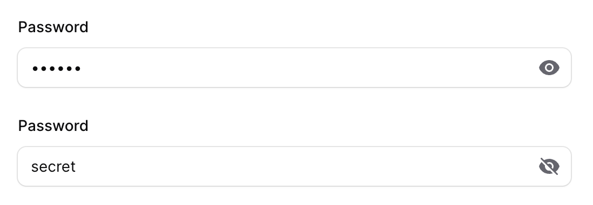
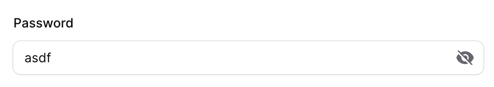

# filament-password-input

[](https://packagist.org/packages/rawilk/filament-password-input)

[](https://packagist.org/packages/rawilk/filament-password-input)
[](https://packagist.org/packages/rawilk/filament-password-input)
[](https://github.com/rawilk/filament-password-input/blob/main/LICENSE.md)


`filament-password-input` is a package built for [Filament](https://filamentphp.com) that provides an enhanced password input form component that offers you the ability to add the following
features to your password inputs:

-   Reveal password toggle
-   Copy to clipboard
-   Generate new password button

## Installation

You can install the package via composer:

```bash
composer require rawilk/filament-password-input
```

That's it. There is no configuration file or migrations necessary for the package.

## Usage

Inside a form schema, you can use the `Password` input like this:

```php
use Rawilk\FilamentPasswordInput\Password;
use Filament\Forms\Form;

public function form(Form $form): Form
{
    return $form
        ->schema([
            // ...
            Password::make('password')
                ->label('Password'),
        ]);
}
```

The code above will render a password input inside the form with a toggle button to show and hide the password.





## Scripts

### Setup

For convenience, you can run the setup bin script for easy installation for local development.

```bash
./bin/setup.sh
```

### Build

Any time changes are made to the blade file, the `./bin/build.sh` script should be run so our css can be recompiled.

### Formatting

Although formatting is done automatically via workflow, you can format php code locally before committing with a composer script:

```bash
composer format
```

## Testing

```bash
composer test
```

## Changelog

Please see [CHANGELOG](CHANGELOG.md) for more information on what has changed recently.

## Contributing

Please see [CONTRIBUTING](.github/CONTRIBUTING.md) for details.

## Security

Please review [my security policy](.github/SECURITY.md) on how to report security vulnerabilities.

## Credits

-   [Randall Wilk](https://github.com/rawilk)
-   [All Contributors](../../contributors)

## License

The MIT License (MIT). Please see [License File](LICENSE.md) for more information.
